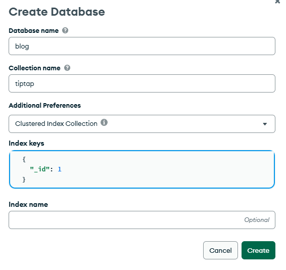
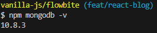

#### `2025-02-28 금요일` 슬슬 승모근 아프기 시작

# frontend.js 반영 안됨 문제

https://stackoverflow.com/questions/18165138/res-sendfile-doesnt-serve-javascripts-well

경로 문제인건 확실한데, 해결책 읽어도 잘 모르겠어서 chatGPT 채찍질함;;
index.html와 server.js를 나란히 두고, public에 구 frontend.js 현 index.js를 두었음. 해결! localStorage 저장까지 잘 실행된다.

# 굳이 express 쓴 이유: DB에 저장하고 불러오려고

그냥 겉껍데기 테스트만 하는 거라면 html을 Live Server로 열어보면 되는데, 이렇게 귀찮은 경로 통한 이유는

1. 결국 어디다 올릴 거니깐
2. DB에 글 저장해야 인터넷 되는 어디서나 불러오지. 아니면 메모장이나 다름없음

# MongoDB Atlas 쓰기

이전에 테스트용으로 쓰던 project 닉변해서 쓸려고. cluster도 밀고 새로 만들었다. 무료 AWS로.




잘 설치되어 있군. 근데 브랜치 이름 뭐임? 레포지토리는 잘 연결되어 있고, 브랜치 이름만 꼬인 것 같으니깐 우선 패스.

# 저장 시각도 같이 저장하기

1. 원래는 index.js에서 하나의 object / json으로 포장해 보내려고 했으나, 알 수 없는 이유로 savedData만 보내져서 코드를 수정함.

```
//index.js
    document
      .getElementById("saveDatabaseButton")
      .addEventListener("click", () => {
        fetch("/save-data", {
          method: "POST",
          headers: { "Content-Type": "application/json" },
          body: JSON.stringify({
            savedTime: now(),
            savedData: localStorage.getItem("savedData"),
          }),
        });
      });
```

fetch 보내는 body에서 savedTime, savedData 묶었다가 다시 req.body 쪼개서 insertOne 하니까 새로운 항목인 savedtime이 추가가 되었다.

```
//server.js - post 요청으로 값 보내고, db 접근하니까 async
app.post("/save-data", async (req, res) => {
  const { savedTime, savedData } = req.body;
  await db
    .collection("tiptap")
    .insertOne({
      savedData: savedData,
      savedtime: savedTime,
    })
    //이 뒤에는 디버깅 이고
});
```

2. 그러나 바로 `new Date()`를 먹였더니 `savedTime: null` 찍힘. 인스턴스 가리키게 되어서인가? 함수로 무조건 반환되는 값 집어넣도록 하였음.

```
function now() {
  const now = new Date().toISOString();
  return now;
}
```

기본적인 기능은 잘 되었다. 앞으로 구현할 기능:

1. 코드 스니펫 추가하기 등등 index.js 선에서 구현할 것들
2. 저장된 글 목록 보는 페이지 (제목, 날짜, 앞문장 정도?)
3. 승모근 풀기 (하루죙일 코딩했더니 너무 아픔!)
