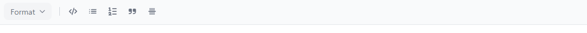
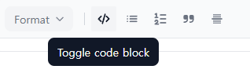
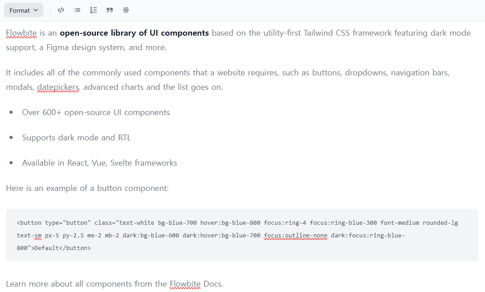

#### `2025-02-28 금요일` 오늘까지 열심히 하고 주말은 쉬기!

이전까지는 바닐라 js로 포스트잇 스티커 붙였다 떼는 구현을 했다.
유저가 보는 것은 정적인 블로그이더라도, 위지윅 에디터를 개발 블로그 내에 포함시키려면 모든 것을 내가 스스로 만들 수는 없다.

바퀴를 만드는 대신 바퀴 쇼핑에 들어갔다가, 배보다 배꼽이 커지는 경우 (React에 대한 심도 있는 이해가 필요한 경우부터) 가 생겨서 잠시 미뤄두었는데,
tailwind CSS를 무료로 사용할 수 있는 방법에 대해 찾아보다 flowbite를 찾았고 공식 문서에서 위지윅 에디터를 html/js로 구현한 샘플 코드를 보게 되었다.

심지어 svg도 html 안에 생짜로 넣어둔 탓에, 코드가 상당히 길어 읽기 힘들다. 그래서 오늘은 샘플 코드를 분철해 보는 시간을 갖겠다!




크롬 개발자 모드에서 뜯어보면 조금 보기 쉽다.

```
 텍스트 에디터랑 편집기 헤더 전부 들어있는 div
    ㄴ 편집기 헤더
        ㄴ 패딩이랑 갭 좀 주고
            ㄴ button id="typographyDropdownButton"
            ㄴ div class="ps-1.5" 버튼들 나눠주는 ui 장식
            ㄴ div id="typographyDropdown" 드롭다운 버튼 눌렀을 때. div class="ps-1.5"가 오른쪽에 가고 아래에 얘가 있도록 해 놨군.
            ㄴ 기타 버튼들
                ㄴ button id="toggleCodeBlockButton"
                ㄴ div id="tooltip-code-block" : 버튼 위에 마우스 hover 했을 때 뜨는 말풍선

                ㄴ button id="toggleListButton"
                ㄴ div id="tooltip-list"

                ㄴ button id="toggleOrderedListButton"
                ㄴ div id="tooltip-ordered-list"

                ㄴ button id="toggleBlockquoteButton"
                ㄴ div id="tooltip-blockquote-list"

                ㄴ button id="toggleHRButton"
                ㄴ div id="tooltip-hr-list"
    ㄴ 텍스트 에디터
```

script.js에 샘플용 js 코드도 복붙해 놨는데 왜 껍데기 html만 보일까? 이 부분 수정하고 나서 필요한 버튼만 남겨보겠다. 아, import 있는데 type="module" 없어서구나.
공식 문서에서 cdn으로 가져오는 법 따라했더니 잘 보이고, 기능 테스트도 잘 된다.



내부 포맷팅 변경은 flowbite 코드가 해주고 있음을 참고할 것.
